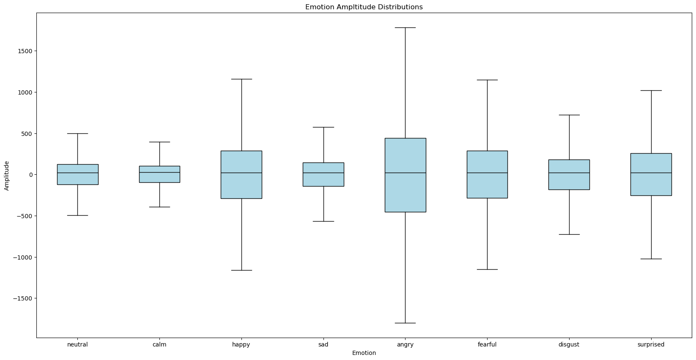
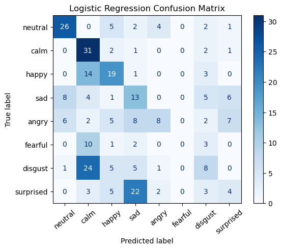
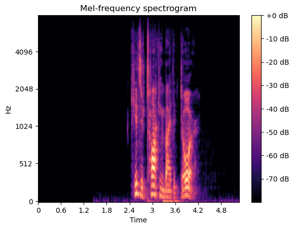
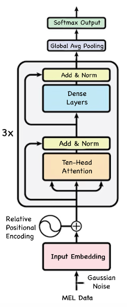
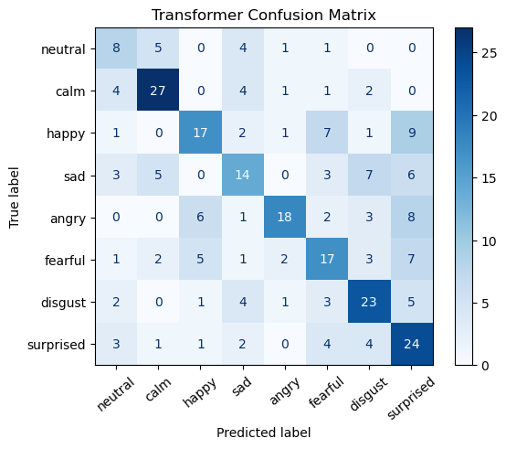
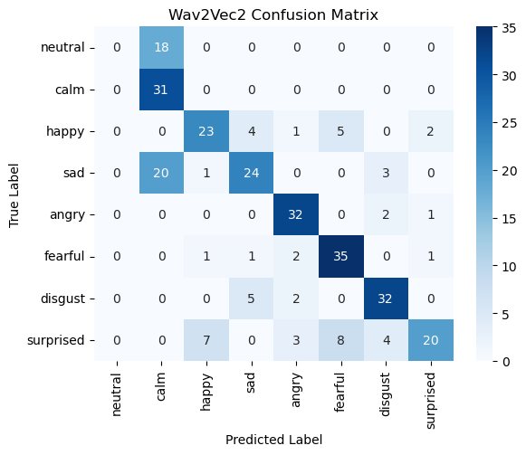

## Audio Sentiment Analysis
###### (see the full notebook [here](/docs/audio_sentiment_copy.html))  
  
  
**Project description:** The aim of this project is to develop a robust emotion classification system capable of accurately identifying the emotional state of a speaker based on an audio clip of their speech. Emotion classification from audio presents a considerable challenge due to the inherent variability in speech patterns, pitch & tones, and the subjective nature of emotions. But the benenfits of such a model are apparent; its depolyment in voice assistants or sentiment analysis tools would enable timely and accurate emotion recognition from audio inputs, fostering advancements in human-computer interaction and affective computing. 

We explore a number of different model architectures to accurately classify each audio clip into 1 of 8 different emotional tones, and weigh the advantages and drawbacks of each approach to better understand the difficulties and opportunities associated with audio sentiment analysis.

### 1. Data

Our data comes from the Ryerson Audio-Visual Database of Emotional Speech and Song (RAVDESS) (see some example clips [here](https://www.youtube.com/watch?v=UAFnlguE7Is)). This database contains audios from 24 professional voice actors, 12 female and 12 male, each of whom, as stated by RAVDESS, have a “neutral North American accent”. There are two phrases which they all say. The first phrase is “Dogs are sitting by the door” and the other is “Kids are talking by the door”. Every actor says each phrase in 8 different emotional tones: “neutral”, “calm“, “happy“, “sad“, “angry“, “fearful“, “disgust“, and “surprised“. Every tone except neutral also has an emotional intensity: “normal“ or “strong“. This amounts to 1,440 total audio samples, each a 1-dimensional array of amplitudes with an average length of 177,632.

### 2. EDA and Baseline Model

Before processing the data or training more complex deep learning models, we first explored the 1-D samples to see if there may be some distinguishing features. We found that there were notable differences in the lengths and amplitude variations (pictured below) of the 8 emotions.

After creating a dataset with 2 predictors (audio clip length and amplitude variation), we trained a simple logistic regression model to predict the emotion and establish a baseline. This achieved a test accuracy of 37.8%, and the confusion matrix below provides a more granular view of the results.

  
  
### 3. Preprocessing

Next, to prepare them as inputs for deep learning models, we front-padded the data to a uniform size then converted the samples into mel spectrograms. This is a standard pre-processing step for audio ML models that transforms the data from 1-D to 2-D.  

  
  
### 4. Model Training

My main task was to build and train a custom transformer model on the processed data. The specific bidirectional encoder architecture is pictured below.

This multi-head transformer model takes in the audio data and outputs predictions for each audio sample's emotion. First, the two-dimensional Mel-transformed data (495 timesteps, 296 Mel features) is passed into the model. Gaussian noise is then applied with a standard deviation of 0.1. After this, it is passed through a dense layer with 50 nodes in order to get 495 embeddings (one for each time step) with `embed_dim` = 50.  
  
Drawing inspiration from the DeBERTa model, a custom relative positional encoder was used rather than a fixed sinusoidal positional encoder, as in traditional transformers. First, I created a `get_relative_positions` function to create a matrix that stores the distances between each of the 495 timestep vectors in the audio data. Then a `get_relative_positional_encoding` function converts each relative position into a vector of size `embed_dim` = 50 so that they can be added to the embeddings.
  
These embeddings are then passed through 3 successive transformer layers. In each layer, ten-head attention is applied, meaning each head receives one-tenth of the embeddings (i.e., vectors of length 5). Dropout is also applied to the multi-head attention step with a rate of 0.2. The output from the attention step is added to its original input (a skip connection) and layer-normalized. Then it is passed through a feed-forward network in which the first dense layer has 192 nodes and the next dense layer has 50 nodes in order to reshape it back to the original size of the embedding, `embed_dim` = 50. An add-and-normalize step is also in the FFN stage.  
  
After the embeddings have been transformed by the 3 transformer layers, a global average pooling layer converts the 495 x 50 matrix into a 1-dimensional vector of length 50, essentially creating one embedding that represents the entire audio sample. Finally, this is passed into the softmax output layer, which returns a probability distribution across the 8 emotions, with the highest value indicating the model's prediction. This model achieved an accuracy of 51.4%, and did so while being very light-weight, with a parameter count of only 377,000–over 250x less than that of the SOTA model described in the next section.

  

  
### 4. SOTA Model Fine-Tuning
Lastly, we fine-tuned Facebook’s Wav2Vec 2.0 model, described in their [paper](https://arxiv.org/abs/2006.11477) “wav2vec 2.0: A Framework for Self-Supervised Learning of Speech Representations.” This model has 95 million parameters and was trained on thousands of hours of raw speech audio data sampled at 16kHz. In order to implement the model, we used a Trainer object from the Transformers module, which is specialized for fine-tuning pretrained models. We also employed the Transformer module’s AutoFeatureExtractor class, which normalizes and processes the audio data in a manner required by the model. Our code was heavily inspired by this HuggingFace [tutorial](https://huggingface.co/docs/transformers/en/tasks/audio_classification) on fine tuning an audio model. Due to long training time and limited GPU access on colab (ran into various  pytorch dependency errors on Jupyter Hub), we were only able to train for 10 epochs, which took approximately 32 minutes. The model achieved the highest accuracy, at 62.5%.

  
