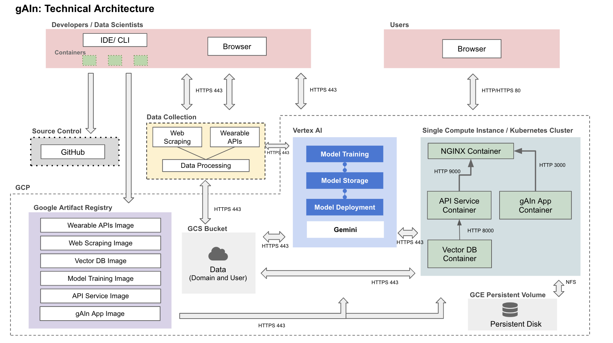
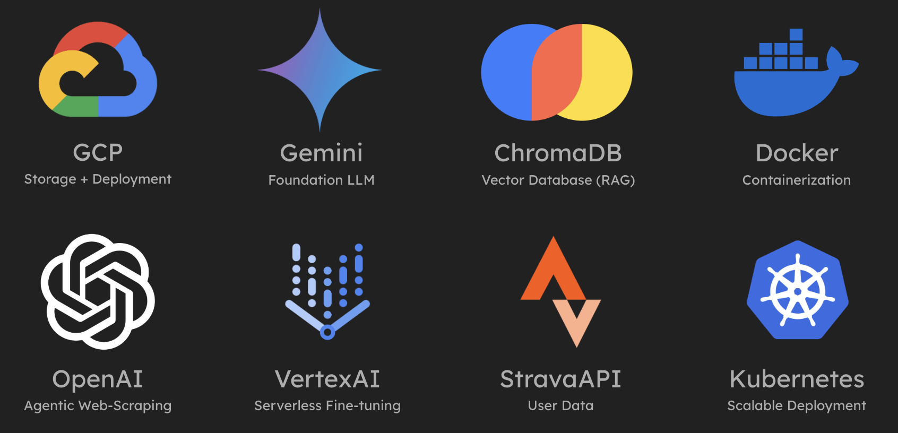

## gAIn: Your Personal Health and Fitness Coach
##### (see our GitHub repo [here](https://github.com/madsgroholdt/AC215_gAIn) and our Medium post [here](https://medium.com/@jakepappo/gain-the-future-of-health-and-fitness-192836683427))

  
### The Problem: No Simple, Personalized Health Platform

In today’s world, health and fitness information is abundant — but often overwhelming. The average person struggles to keep up with evolving research, fitness trends, and their own personal goals. Whether you’re looking to lose weight, gain muscle, or simply live a healthier life, navigating the sea of generalized advice is daunting.

On the other hand, the age of big data has unlocked an unprecedented amount of personal health and fitness metrics. However, humans are not capable of processing all of their data in order to formulate optimal decisions.

For goal-oriented individuals, fitness enthusiasts, and anyone looking to stay healthy, the challenges are clear:
  1. **Overgeneralization**: Most freely accessible health resources fail to account for individual lifestyles and needs.
  2. **Lack of Accessibility**: Personalized advice typically requires expensive and time-consuming personal trainers.
  3. **Information Overload**: Constantly evolving research and automated personal data collection (via wearable devices) leave users with fragmented insights and no clear path forward.

The result? No single, trusted, user-friendly platform offers tailored advice, up-to-date insights, and expert-level guidance in one place.  

### Enter gAIn: Your Personalized Health and Fitness AI Assistant

gAIn is an AI-driven health and fitness coach designed for the modern user. By integrating cutting-edge research with personal data, gAIn delivers actionable, tailored advice on workouts, nutrition, and overall wellness — all through an intuitive interface.

Here’s what makes gAIn unique:
  - **Personalized Insights**: Seamlessly connects to your favorite fitness devices and apps, like Strava, and uses your historical activity to give advice.
  - **Domain Expertise**: Leverages a fine-tuned AI model trained on verified health and fitness research to provide trustworthy, up-to-date recommendations.
  - **Simple UI**: Designed for ease of use, the platform empowers users to interact directly with their AI assistant to get answers, insights, and plans that fit their unique goals.

  

### Behind the Scenes: The Technology Powering gAIn

Building a personalized AI health coach requires an elegant blend of modern machine learning, data engineering, and user-centric design. Here’s how we’ve brought gAIn to life:
1. **Data Pipeline**
   - Web scraping tools, utilizing **OpenAI** agents, gather accredited health and fitness content (e.g., articles, blogs, research).
   - A fine-tuned **Gemini** LLM, trained on Google Cloud’s **Vertex AI**, provides expert-level understanding of fitness topics.
   - Data versioning within **GCP** ensures consistency and scalability across development.
   - Using Google Cloud’s **Cloud Scheduler**, the model underlying gAIn is retrained on the newest studies and expertise in the industry every week.
2. **Personalization via Vector Databases**
   - User data from fitness devices like Strava is processed into a natural language format and embedded for efficient retrieval in **ChromaDB**.
   - This retrieval-augmented generation (RAG) pipeline enables the LLM to tailor its responses based on individual activity history.
3. **RAG-LLM Integration**
   - The fine-tuned Gemini model acts as the intelligent core, capable of synthesizing general health insights with personal data to offer hyper-specific advice.
   - Queries like “How can I improve my recovery based on last week’s workouts?” are answered with contextually relevant, actionable suggestions.
4. **User-Centric Frontend**
   - Built on **React**, the app’s clean interface makes interacting with the AI coach seamless.
   - Users can browse the latest fitness research in the in-app Newsletters section or receive real-time recommendations for their specific health objectives.
5. **Scalable Deployment**
   - The web application is containerized with **Docker** and deployed on a **Kubernetes** cluster via **Google Cloud**.
   - **Ansible** automates infrastructure setup and deployment, ensuring a robust and scalable deployment pipeline.

  

### Why gAIn Matters

gAIn revolutionizes the way people approach health and fitness by combining cutting-edge research, wearable data, and personalized coaching into an affordable, accessible AI assistant. With gAIn, users no longer need to sift through mountains of health data or piecemeal advice from various sources. Instead, they can simply engage in a conversation, whether it’s about their progress, next steps, or long-term goals.

This constant and comprehensive awareness allows users to take a proactive approach to their wellness journey, armed with insights tailored specifically to their activity, lifestyle, and objectives. Unlike traditional personal trainers, gAIn has complete recall of a user’s history and goals, expert knowledge from across the internet, and 24/7 availability — all at only a fraction of the cost.  

### What’s Next for gAIn?

As we continue to innovate, gAIn’s future includes:
  - **More API Integrations**: Linking user data from other platforms and wearable devices, such as Apple HealthKit, MyFitnessPal, and WHOOP.
  - **Mobile App Deployment**: Extending the platform to iOS and Android for even greater accessibility.
  - **Enhanced AI Specialization**: An improved RAG system that utilizes metadata for filtering through user data, and an agentic LLM that can perform various calculations.
  - **Community Features**: Tools for users to share goals, progress, and learn from one another.

Join us as we transform the way people achieve their health goals—one question at a time.

