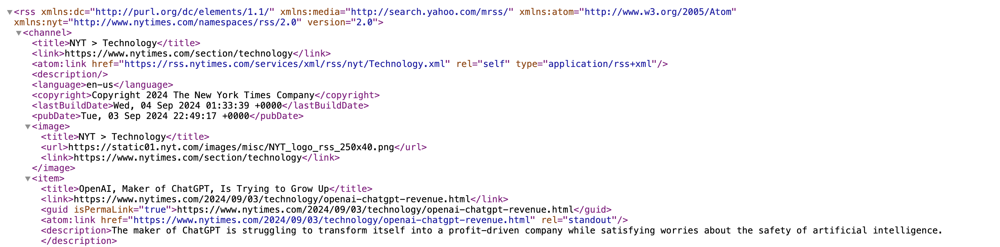
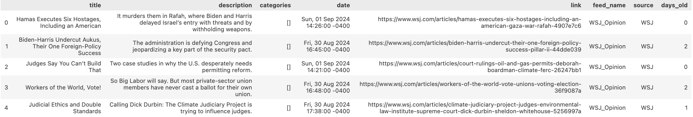
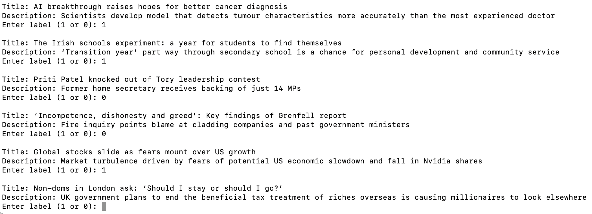
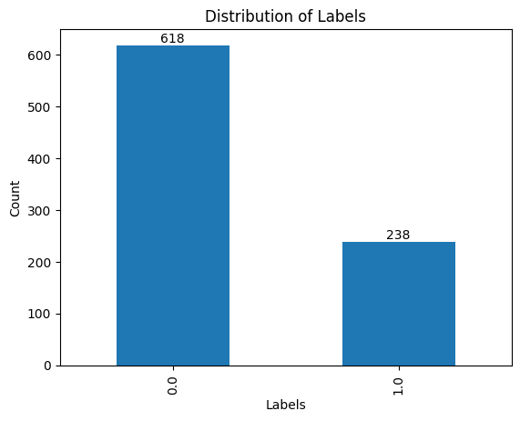
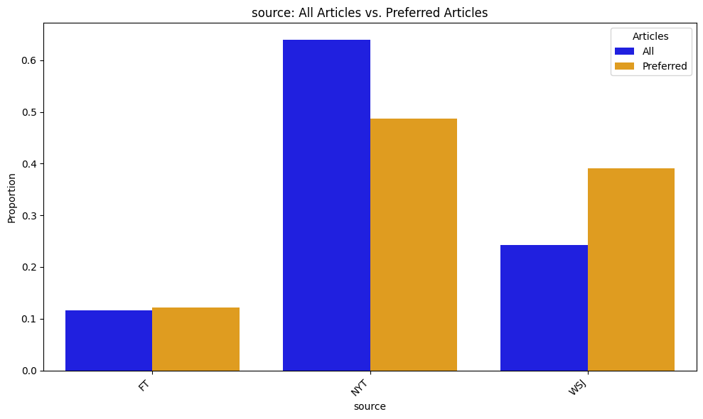
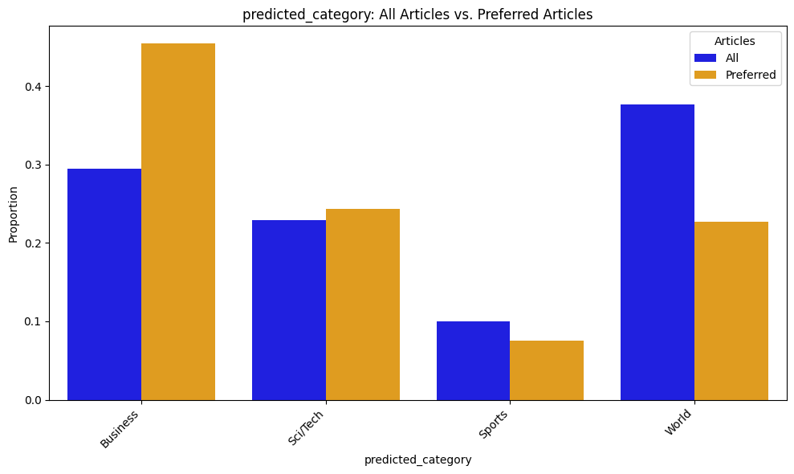
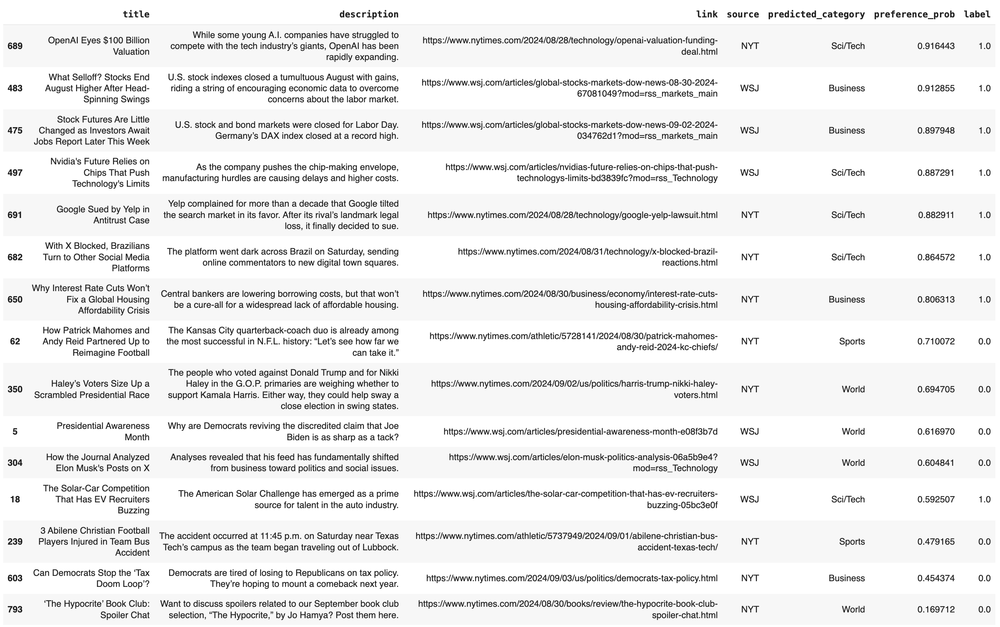

## Personalized News Aggregator
##### (see the code [here](/docs/news_agg.html))  
  
  
**Project description:** In this project, I create a tool that saves me the time of scrolling through multiple news sources in order to find articles that interest me. I do so by building a smart news aggregator that automatically reads in the daily article feeds from my go-to newspapers and selects those that I would be most likely to read.

First, information is collected on each article and loaded into a dataframe. In addition to the publicly available metadata, I use a fine-tuned BERT model that assigns a category to each article. To get personal preferences for the recommender, I label each article with a `1` to indicate that I would read it or a `0` to indicate that I would not. Models are then trained to learn my preferences, effectively predicting the articles that I would read then suggesting them to me.


### 1. Data Collection

Most major publications have public RSS feeds that contain information on each article, including the title, description, link, source, and  publication date. Here, I access RSS feeds from my favorite news sources: *The New York Times*, *The Wall Stree Journal*, and *Financial Times*. I use [feedparser](https://feedparser.readthedocs.io/en/latest/)–designed specifically for RSS feeds–and [Beautiful Soup](https://beautiful-soup-4.readthedocs.io/en/latest/) to take the relevant information out of each feed's XML format. I then combine the data from each feed into one dataframe.  

Pictured below is a snippet from the RSS feed for the Technology section of *The New York Times*, and, more specifically, the first listed article: "OpenAI, Maker of ChatGPT, Is Trying to Grow Up". Note how its metadata is stored in a standardized set of tags, such as `<title>`, `<link>`, and `<description>`. This format is also standardized across publications, allowing libraries like feedparser to efficiently extract information from any RSS feed.




### 2. Feature Engineering

The relevant features provided in the metadata of the RSS feeds are shown below.



Although *NYT* and *FT* provide data on the categories included in each article, such is not the case for *WSJ*, as seen in the third row's empty `categories` entry above. In addition to this, the set of categories are not standardized between publications and also tend to be overly specific, thus limiting their generalizablility and predictive potential for a recommendation model. 
  
Existing LLMs can be used to enrich the dataset by classifying articles based on their associated textual data. I utilize the fine-tuned BERT model [`bert-base-uncased-ag_news`](https://huggingface.co/fabriceyhc/bert-base-uncased-ag_news), which is trained on the [AG News dataset](https://huggingface.co/datasets/fancyzhx/ag_news). This takes in the concatenated `title` and `description` of an article and predicts one of four categories: `Business`, `Sci/Tech`, `Sports`, or `World`. In the sample articles above, BERT accurately assigns `Sci/Tech` to the first article about a brain study, `World` for the second article about emigration in Venezuela, and `Business` for the third article about the US electric vehicle market. This creates the new `predicted_category` variable–standardized across all publications–that can be used to make high-level distinctions between articles.

Here is the code that runs inference on the BERT model to extract the new feature from an article's textual data:
```python
# Load the tokenizer and model
tokenizer = AutoTokenizer.from_pretrained("fabriceyhc/bert-base-uncased-ag_news")
model = AutoModelForSequenceClassification.from_pretrained("fabriceyhc/bert-base-uncased-ag_news")

# Functions to classify the articles using the fine-tuned BERT model
categories = ["World", "Sports", "Business", "Sci/Tech"]
def classify_article(text):
    inputs = tokenizer(text, return_tensors="pt", truncation=True, padding=True)
    outputs = model(**inputs)
    probabilities = torch.softmax(outputs.logits, dim=1)
    predicted_class = torch.argmax(probabilities, dim=1).item()
    return categories[predicted_class], probabilities[0].tolist()

def classify_row(row):
    # If the predictions have already been calculated, return them
    if pd.notna(row.get('predicted_category')) and pd.notna(row.get('predicted_probs')):
        return pd.Series([row['predicted_category'], row['predicted_probs']])
    # If not, make the predictions and store them
    text = f"{row['title']} - {row['description']}"
    predicted_category, probabilities = classify_article(text)
    return pd.Series([predicted_category, probabilities])

# Predict all the articles' categories with the BERT model
df[['predicted_category', 'predicted_probs']] = df.apply(classify_row, axis=1)
```
  
  
### 3. Automated Script for Daily Article Updates

Although I can successfully parse the article data and load it into a DataFrame, the RSS feeds are constantly updating. To ensure that all published articles are captured, the data collection functions need to be run daily. Therefore, I created a Bash script to automate the daily execution of `update_articles.py`, which does the following:  
   1) Loads in article data from the current day's RSS feeds  
   2) Run inference on `bert-base-uncased-ag_news` to get the `predicted_category` feature  
   3) Updates the ongoing article database by merging in the current day's entries 

Here’s the Bash script used to run `update_articles.py` daily:
```bash
#!/bin/bash

# Don't run the script if it has already run today
LAST_RUN_FILE="/tmp/last_update_articles_run"
TODAY=$(date +%Y-%m-%d)
if [ -f "$LAST_RUN_FILE" ] && [ "$(cat $LAST_RUN_FILE)" == "$TODAY" ]; then
    echo "Script has already run today. Exiting." >> /tmp/update_articles.log
    exit 0
fi

# Run the Python script and log the start/end times
echo "Script started at $(date)" >> /tmp/update_articles.log
/Users/jakepappo/micromamba/envs/sauron/bin/python3 /Users/jakepappo/Documents/Stuff/Projects/news_agg/update_articles.py >> /tmp/update_articles.log 2>&1
echo "Script finished at $(date)" >> /tmp/update_articles.log

# Update the last run date
echo "$TODAY" > "$LAST_RUN_FILE"
```

This script first checks to see if it has already been successfully run today. If not, it logs the start time, executes the Python script, logs the end time, and updates the last run date. This ensures that the data collection process is performed daily without manual intervention.  

To automate the execution of this Bash script on a daily basis, I created a .plist file for a LaunchAgent. The .plist file is a configuration that tells the macOS launchd system to trigger the Bash script at specific times or events. In this case, the LaunchAgent is configured to run the script as soon as I log into my Mac. It ensures that the script is executed every day and restarts if it fails, providing a robust and automated solution to manage daily data collection.


### 4. Labeling Article Preferences

Like any model, I will need labels for the variable that I am trying to predict. In this case, I want to create a model that learns what articles interest me. I encode this variable, which we will call `label`, as a binary indicator variable such that:


The binary encoding approach is not only simpler than, say, rating each article on a scale from 1 to 10, but it also mirrors a more practical and scalable user data collection strategy. Instead of manually labeling the data as I am doing now, these `1`s and `0`s can be implicitly gathered by tracking whether or not I clicked on an article. Therefore, this method can seamlessly integrate with natural user behavior, allowing for efficient data collection without requiring the friction of active user inputs.

In order to label the data, I created a script that prompts the user (i.e., me) with the title and description of each article, accepts either a `1` or `0`, then plugs this value into that article's `label` entry in the dataframe. At scale, this script would be replaced with the aforementioned tracker that records whether a user clicked on an article. The below screenshot from my command line shows the labeling function in use:  




### 5. Data Exploration

Let's explore the data before jumping right into making recommendations. This will allow me to visualize my preferences and get a preliminary sense of the predictive potential behind the features.

First, I inspect the target variable, `label`, to see the raw article counts and the imbalance between the two classes. There are 856 total articles, with `label=0` for 618 of them and `label=1` for the remaining 238. There are several ways to deal with this imbalance, which will be discussed in the modeling section.



Next, I break down the newspaper sources for the articles. These distributions are shown for both the entire article set and for my preferences (i.e., articles with `label=1`). The graph below suggests that I disproportionately favor *The Wall Street Journal*, which makes up around 25% of all the articles but 40% of those that I would read. *The New York Times*, on the other hand, drops in its prevalence, though still makes up nearly half of my preferences due to its high volume of articles. This makes sense because *WSJ* caters more to my interests in technology and business, whereas *NYT* covers a much wider array of topics.



My interests are more directly reflected in the distributions of `predicted_category`, which classifies each article into one of four categories based on its title and description. `Business` and `Sci/Tech` are more represented among my preferences, whereas `Sports` and `World` are less represented.



### 6. Pre-Processing

Because there is not a significant amount of data, traditional ML models will be trained on the tabular dataframe to predict the label. However, as the article archive grows from the daily updates, it will get to the point at which training/fine-tuning an RNN- or transformer-based model is the best solution. For now, though, the text data must be processed before being fed into the model. Here I use a common approach of using sklearn's [TfidfVectorizer](https://scikit-learn.org/stable/modules/generated/sklearn.feature_extraction.text.TfidfVectorizer.html).
  
First, the title and description are concatenated into a single text variable. Then, for each article, the TfidfVectorizer converts the words in the vocabulary into TF-IDF scores. These scores balance the term frequency (TF), which measures how often a word appears in an article, with the inverse document frequency (IDF), which downweights words that are common across all articles. While this approach may not capture complex contextual relationships within the text, it efficiently generates numerical representations that emphasize the most significant words associoated with each article.

The other predictors in the dataset–`source`, `feed_name`, and `predicted_category`–are all categorical. Therefore, I one-hot encode them so that they can be handled by an ML model.


### 7. Modeling

Because the dataset contains 856 total articles, 238 of which I would read (i.e., `label=1`), more advanced ML models will not be able to sufficiently "learn" my preferences. But, as the dataset's size increases (here, it has 6 days of articles), so too will the complexity and accuracy of the best recommendation model.

For now, a simple L2-regularized logistic regression still performs well, establishing a promising baseline on which to improve. Also, note that the `class_weight` argument is set to `balanced`, which adjusts the weight of each data point so that it is inversely proportional to the frequency of its class. This ensures against the model becoming biased towards the majority class, or, in this case, `label=0`. The F1 score–which balances both precision and recall–is also used to account for the class imbalance, resulting in a more robust model.

```python
logistic = LogisticRegressionCV(Cs=10, penalty='l2', scoring='f1', class_weight='balanced', n_jobs=-1, random_state=0)
logistic.fit(X_train, y_train)
```

With the above 2 lines of code, I fit a model that achieves an accuracy of 74.4% and an F1 score of 54.5% on the test set.

I also fit a random forest model, in which I used `GridSearchCV` to find the best `max_depth` and `min_samples_split` hyperparameters. It performed slightly worse than the logistic regression, though, with an accuracy of 73.8% and an F1 score of 49.4%. This makes sense since the dataset is relatively small, and there are only 4 predictor variables (`text`, `predicted_category`, `source`, `feed_name`).

The article archive is automatically adding ~100 articles each day, though. As mentioned earlier, once the dataset reaches a sufficient size, I will be able to use more advanced models. For example, I could fine-tune my own BERT model to directly classify an article's `label` variable. However, this would require tons of data. (To put it into perspective, the `bert-base-uncased-ag_news` model was trained on 120,000 rows from the AG News dataset.)


### 7. Making Recommendations

The logistic regression model is still capable of analyzing a large collection of unlabeled (and presumably new) articles to identify those that are most likely to be of interest to me. The model predicts the probability that `label=1`, which I store in the `preference_prob` variable. These can serve as a proxy for how engaging or relevant the article is to me on a scale from 0 to 1, and since articles with the highest confidence predictions will be selected, the accuracy of the model is effectively increased. However, simply recommending the top *n* articles based on `preference_prob` alone is not an ideal solution for two main reasons.

**1) Ensuring Topic Diversity in the User Experience**
- Recommending only the highest-scoring articles can trap users in content echo chambers, reinforcing their existing preferences and limiting exposure to a broader range of topics. This can be avoided by incorporating a balance of high-confidence articles with a curated selection of diverse content. This strategy keeps the user experience fresh and encourages the exploration of topics outside their regular interests.

**2) Model Improvement Through Feedback**
- To continually improve the model’s accuracy and relevance, it’s crucial to provide a diverse set of articles, including random selections. Showing only high-confidence articles will limit the variety of feedback the model receives, making it difficult to capture evolving user preferences over time. By presenting a mix of familiar and unexpected content, the tool enables continuous learning about my evolving interests. Over time, this leads to more accurate recommendations, making the reading experience more engaging and personalized, while still providing exposure to new topics.

Therefore, the articles are algorithmically recommended with the following steps:
1. Find the Most Relevant Articles: The `recommend_articles` function first selects the top 10 articles that are predicted to be most relevant to me based on `preference_prob`–the model's predicted probability that `label=1`.
2. Ensure Category Diversity: To avoid overloading one category, the function then checks that each of the four categories (from `predicted_category`) has at least two articles. If any category is underrepresented, it removes a less relevant article from an overrepresented category and replaces it with a more relevant article from the lacking category. This ensures a mix of content across different topics.
3. Add Random Articles for Variety: To keep things fresh and help the model learn more about my preferences, five additional articles that haven't been picked are randomly selected. This helps avoid repeatedly displaying similar content.
4. Make Recommendations: After the articles are carefully selected based on relevance and diversity, the tool presents the final list of 15 articles to me, each accompanied by the relevant information such as the title, description, and a direct link to the full article.

The specific criteria and process for selecting articles can be adjusted in a number of ways. For example, articles can be sampled according to their `preference_prob`, other variables like `source` can be considered, the number of articles can be adjusted, and the list goes on. I created the above example to demonstrate how the recommender can leverage an ML classification model that learns from a user's media consumption patterns, while also maintaining a degree of stochasticity. And, at the end of the day, the biggest improvement will come from a larger dataset, which will allow for the leveraging of more complex models like LLMs.

And here are the 15 articles recommended to me by the complete recommendation algorithm!

