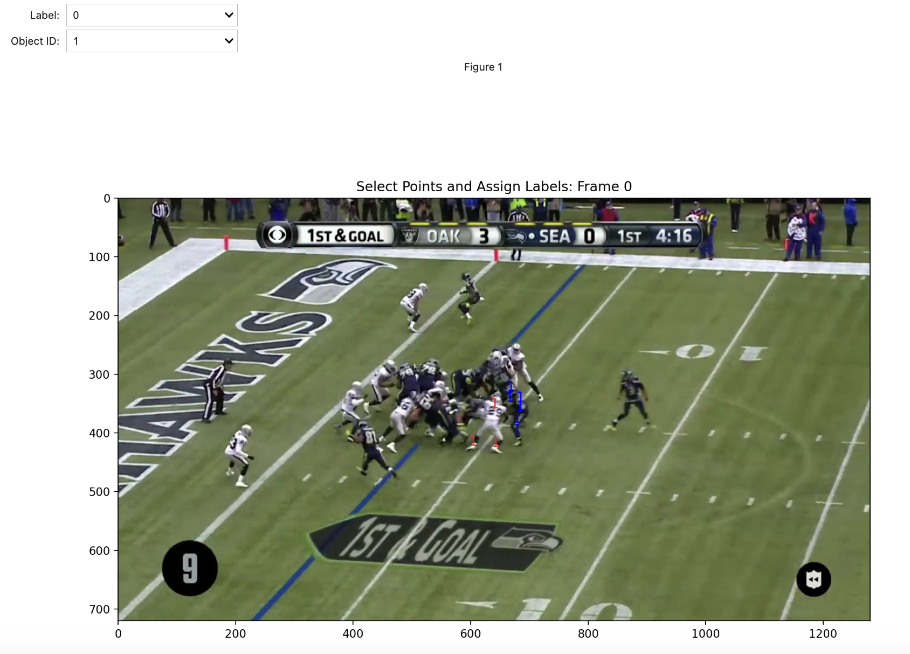

## SAM 2 Annotation Tool
###### (see the full notebook [here](/docs/SAM2_tool.fixed.html))  
  
  
**Project description:** In this notebook, I walk through a user-friendly tool I created that allows you to accurately label a video for object tracking tasks.
  
The tool annotates the video by passing it through Meta's [SAM 2](https://ai.meta.com/sam2/) model and allowing a human-in-the-loop to correct its mistakes. SAM 2 is specifically designed for such a use case, as it is a *promptable* visual segmentation (PVS) model. Thus, before any object can be tracked, it must be identified in a given frame with a point(s), a bounding box, or a mask. After the initial prompt, SAM 2 will then track the object(s) throughout the video. If a given masklet is lost (e.g., from an occlusion), SAM 2 will require a new prompt in order to regain it.  

SAM 2's transformer-based architecture learns both motion- and appearance-based features and outperforms many of the top existing tracker models. Its promptable nature also makes it especially well-suited for providing initial high-fidelity labels that can be further refined with just a few clicks.  

### 1. Create the SAM 2 Predictor

First, load in an instance of the SAM 2 model. An <code>Inference State</code> is then set from the predictor with respect to the input video. For this walk-through, I demonstrate the capabilities of SAM 2 in tracking Marshawn Lynch throughout one of his touchdown runs. I also use the "tiny" version of SAM 2 here, though it also comes in "small", "base+", and "large".

### 2. Prompt SAM 2

Because SAM 2 is a promptable visual segmentation model, it cannot detect objects on its own but must be prompted with the object that it should segment and track. I created a user-friendly interface with which you can select points to isolate the object(s) of interest. First, you select the <code>Label</code> of the clicked point, with 1 indicating that the point is on the object, and 0 indicating that it is not on the object. Also, the <code>Object ID</code> feature, though not used here, lets you prompt SAM 2 with multiple objects for independent segmentations. In the image below, I positively label points on Marshawn Lynch and negatively label points on the defender next to him in order to get an accurate mask for SAM 2 to propagate.

Given this prompt, SAM 2 returns a segmented mask for Lynch in this first frame. I also added a function that derives the implied bounding box from the mask. This is especially useful for providing labeled data that can be used to fine-tune and evaluate object detection and tracking models that are trained on bounding boxes.

  

### 3. Run Inference

Next, to prepare them as inputs for deep learning models, we front-padded the data to a uniform size then converted the samples into mel spectrograms. This is a standard pre-processing step for audio ML models that transforms the data from 1-D to 2-D.  

  
  
### 4. Review the Output and Identify Mistakes

My main task was to build and train a custom transformer model on the processed data. The specific bidirectional encoder architecture is pictured below.

This multi-head transformer model takes in the audio data and outputs predictions for each audio sample's emotion. First, the two-dimensional Mel-transformed data (495 timesteps, 296 Mel features) is passed into the model. Gaussian noise is then applied with a standard deviation of 0.1. After this, it is passed through a dense layer with 50 nodes in order to get 495 embeddings (one for each time step) with `embed_dim` = 50.  
  
Drawing inspiration from the DeBERTa model, a custom relative positional encoder was used rather than a fixed sinusoidal positional encoder, as in traditional transformers. First, I created a `get_relative_positions` function to create a matrix that stores the distances between each of the 495 timestep vectors in the audio data. Then a `get_relative_positional_encoding` function converts each relative position into a vector of size `embed_dim` = 50 so that they can be added to the embeddings.
  
These embeddings are then passed through 3 successive transformer layers. In each layer, ten-head attention is applied, meaning each head receives one-tenth of the embeddings (i.e., vectors of length 5). Dropout is also applied to the multi-head attention step with a rate of 0.2. The output from the attention step is added to its original input (a skip connection) and layer-normalized. Then it is passed through a feed-forward network in which the first dense layer has 192 nodes and the next dense layer has 50 nodes in order to reshape it back to the original size of the embedding, `embed_dim` = 50. An add-and-normalize step is also in the FFN stage.  
  
After the embeddings have been transformed by the 3 transformer layers, a global average pooling layer converts the 495 x 50 matrix into a 1-dimensional vector of length 50, essentially creating one embedding that represents the entire audio sample. Finally, this is passed into the softmax output layer, which returns a probability distribution across the 8 emotions, with the highest value indicating the model's prediction. This model achieved an accuracy of 51.4%, and did so while being very light-weight, with a parameter count of only 377,000–over 250x less than that of the SOTA model described in the next section.

  

  
### 4. Fix the Mistake with a New Prompt
Lastly, we fine-tuned Facebook’s Wav2Vec 2.0 model, described in their [paper](https://arxiv.org/abs/2006.11477) “wav2vec 2.0: A Framework for Self-Supervised Learning of Speech Representations.” This model has 95 million parameters and was trained on thousands of hours of raw speech audio data sampled at 16kHz. In order to implement the model, we used a Trainer object from the Transformers module, which is specialized for fine-tuning pretrained models. We also employed the Transformer module’s AutoFeatureExtractor class, which normalizes and processes the audio data in a manner required by the model. Our code was heavily inspired by this HuggingFace [tutorial](https://huggingface.co/docs/transformers/en/tasks/audio_classification) on fine tuning an audio model. Due to long training time and limited GPU access on colab (ran into various  pytorch dependency errors on Jupyter Hub), we were only able to train for 10 epochs, which took approximately 32 minutes. The model achieved the highest accuracy, at 62.5%.

  

### 5. Re-Run Inference for the Final Results
Lastly, we fine-tuned Facebook’s Wav2Vec 2.0 model, described in their [paper](https://arxiv.org/abs/2006.11477) “wav2vec 2.0: A Framework for Self-Supervised Learning of Speech Representations.” This model has 95 million parameters and was trained on thousands of hours of raw speech audio data sampled at 16kHz. In order to implement the model, we used a Trainer object from the Transformers module, which is specialized for fine-tuning pretrained models. We also employed the Transformer module’s AutoFeatureExtractor class, which normalizes and processes the audio data in a manner required by the model. Our code was heavily inspired by this HuggingFace [tutorial](https://huggingface.co/docs/transformers/en/tasks/audio_classification) on fine tuning an audio model. Due to long training time and limited GPU access on colab (ran into various  pytorch dependency errors on Jupyter Hub), we were only able to train for 10 epochs, which took approximately 32 minutes. The model achieved the highest accuracy, at 62.5%.

  
